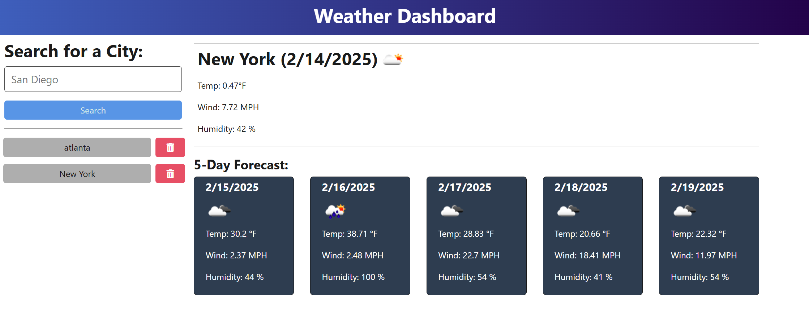

# <Weather API>

## Description

This project was created as a weather forecasting service. It uses an API from https://openweathermap.org/forecast5 to show the next five day forecast. I built this project because it allowed me to practice integrating an API and calling it within an application. During the project I learned how to use API routes from an external API. 

## Installation

Run the command "npm i" in the terminal at the root level to install the npm packages for the project

## Usage

The website allows users to search for a city and it displays the weather for the next 5 days in that city. 

## Credits

Collaborators
    - Joshua Gilbert (https://github.com/joshuag0603)

## License

MIT License

Copyright (c) [2025] [Joshua Gilbert]

Permission is hereby granted, free of charge, to any person obtaining a copy
of this software and associated documentation files (the "Software"), to deal
in the Software without restriction, including without limitation the rights
to use, copy, modify, merge, publish, distribute, sublicense, and/or sell
copies of the Software, and to permit persons to whom the Software is
furnished to do so, subject to the following conditions:

The above copyright notice and this permission notice shall be included in all
copies or substantial portions of the Software.

THE SOFTWARE IS PROVIDED "AS IS", WITHOUT WARRANTY OF ANY KIND, EXPRESS OR
IMPLIED, INCLUDING BUT NOT LIMITED TO THE WARRANTIES OF MERCHANTABILITY,
FITNESS FOR A PARTICULAR PURPOSE AND NONINFRINGEMENT. IN NO EVENT SHALL THE
AUTHORS OR COPYRIGHT HOLDERS BE LIABLE FOR ANY CLAIM, DAMAGES OR OTHER
LIABILITY, WHETHER IN AN ACTION OF CONTRACT, TORT OR OTHERWISE, ARISING FROM,
OUT OF OR IN CONNECTION WITH THE SOFTWARE OR THE USE OR OTHER DEALINGS IN THE
SOFTWARE.following sections.
